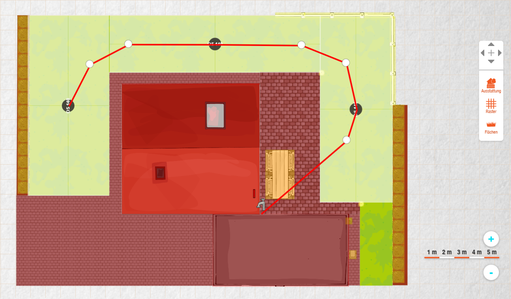
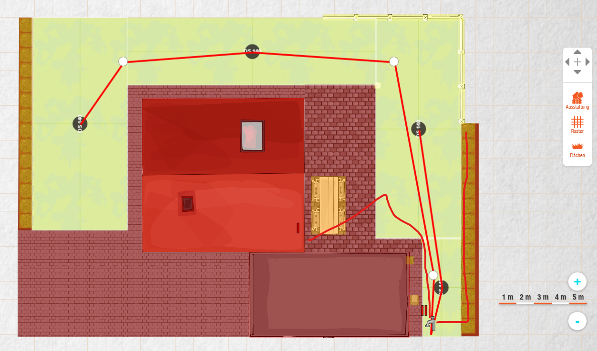

# Irrigation
Upgrade and automate my existing garden irrigation

What i had to 2015 year:
1. Plumbing with water tap
2. One pipeline with 3 [Gardena Pop-up Oscillating Sprinkler R 140 (1537-29)](https://www.gardena.com/int/products/watering/sprinklersystem/pop-up-oscillating-sprinkler-r-140/900933201/))
3. One pipeline for cyprus irrigation with water tap and [Gardena Soaker Hose 15m (1969-20)](https://www.gardena.com/int/products/watering/sprinkler/soaker-hose-15m/900969501/)

Then in 2015 year i change [Gardena Pop-up Oscillating Sprinkler R 140 (1537-29)](https://www.gardena.com/int/products/watering/sprinklersystem/pop-up-oscillating-sprinkler-r-140/900933201/) to [Gardena Pop-Up Oscillating Sprinkler OS 140 (8220-29)](https://www.gardena.com/int/products/watering/sprinklersystem/pop-up-oscillating-sprinkler-os-140/967170901/).

And oooh, I didn’t think that water pressure would be not enough! Now I had to close one tap every time.

Now it is time to change everything :)

In 2019, I drilled a well and decided to rebuild the entire system.

Shopping list (German language):

Pump:

[Metabo P 4500 inox](https://www.bueromarkt-ag.de/gartenpumpe_metabo_p_4500_inox_1300_w,p-600965000,a-gartenpumpen.html) 1x118,99 €=118,99 €

Pump:
[Metabo P 4500 inox](https://www.bueromarkt-ag.de/gartenpumpe_metabo_p_4500_inox_1300_w,p-600965000,a-gartenpumpen.html) 1x118,99 €=118,99 €

Valve box:

[Rain Bird Verteiler mit 4 1'' IG RB1201-410](https://www.amazon.de/dp/B0146WJ9G8) 1x24,36 €=24,36 €

[Gardena 2756-20 ST Ventil-Endkappe 1" IG](https://www.amazon.de/Gardena-2756-20-ST-Ventil-Endkappe-IG/dp/B007C12JBI) 1x7,80 €=7,80 €

[Hunter Magnetventil PGV-101-mmB](https://www.ebay.de/itm/Hunter-PGV-101-MMB-1-Kugelventil-Durchflussregulierung-Aussengewinde-/303070492497) 3x20,49 €=61,47 €

[Druckschalter mit Kabel SKD-2D](https://www.amazon.de/Druckschalter-1-phasig-Pumpensteuerung-Druckwächter-Hauswasserwerk/dp/B01I4Z9DSM) 1x31,18 €=31,18 €

[Verschraubung IG/AG - 1 Zoll - konisch dichtend - messing blank](https://www.amazon.de/gp/product/B07H88N2P1) 2x6,02 €=12,04 €

[GARDENA Messing-Gewindenippel: Messing-Anschlussstück für einen beidseitigen Anschluss an z.B. Pumpen, Rohrgewinde 33.3 mm (G 1") (7261-20)](https://www.amazon.de/GARDENA-Messing-Gewindenippel-Messing-Anschlussstück-beidseitigen-Rohrgewinde/dp/B0001E3ZEI) 1x2,99 €=2,99 €

[VARIOSAN Vorfilter für Pumpen 12562, 1" IG, 8 bar Betriebsdruck, 6000 l/h Durchflussmenge, 0,06 mm Maschenweite](https://www.amazon.de/VARIOSAN-Vorfilter-Betriebsdruck-Durchflussmenge-Maschenweite/dp/B07G1B1B54) 1x24,95 €=24,95 €

[VARIOSAN Reduziernippel 13309, 1 1/4" x 1" AG/AG, Messing, Trinkwasser geeignet](https://www.amazon.de/gp/product/B07WJVW5DH) 1x5,95 €=5,95 €

[GARDENA Messing-Winkel mit Innen- und Außengewinde: Winkelstück mit 42 mm (G 1 1/4")-Gewinde, zur Richtungsänderung von Rohren / Schläuchen (7285-20)](https://www.amazon.de/gp/product/B0001E3ZO8/ref=ox_sc_act_title_1?smid=A3JWKAKR8XB7XF&psc=1) 1x9,49 €=9,49 €

Power and Relays:

[Comatec TRAFO 24 VA 24V Hutschienen-Netzteil (DIN-Rail) 24 V/AC 1 A 24 W](https://www.conrad.de/de/p/comatec-trafo-24-va-24v-hutschienen-netzteil-din-rail-24-v-ac-1-a-24-w-515213.html) 1x29,99 €=29,99 €

[SONOFF 4CH Pro R2](https://www.ebay.de/itm/382915401980) 1x24,29 €=24,29 €

Pipeline and Accesories:

[Gardena Verlegerohr 25 mm (1") 25 m](https://www.real.de/product/35910231) 1x29,99 €=29,99 €

[Gardena Verbinder 25 mm x 25 mm (1")-Außengewinde (2763-20)](https://www.obi.de/sprinkler-systeme/gardena-verbinder-25-mm-x-25-mm-1-aussengewinde/p/9375247) 2x3,79 €=7,58 €

[Gardena Verbinder 25 mm x 25 mm (1")-Innengewinde](https://www.obi.de/sprinkler-systeme/gardena-verbinder-25-mm-x-25-mm-1-innengewinde/p/9375239) 2x3,09 €=12,36 €

[Gardena T-Stück 25 mm x 3/4" (2790-20)](https://www.obi.de/sprinkler-systeme/gardena-t-stueck-25-mm-1-x-19-mm-3-4-aussengewinde/p/9375486) 1x4,69 €=4,69 €

[Gardena Versenk-Viereckregner OS140 8220-29](https://www.hornbach.de/shop/Versenk-Viereckregner-GARDENA-OS-140-fuer-quadratische-und-rechteckige-Flaechen-bis-max-140-qm-Reichweite-bis-15-m-ebenerdig-montiertbar-8220-29/8691516/artikel.html) 1x37,90 €=37,90 €

[Gardena Verbinder 25 mm x 19 mm (3/4")-Innengewinde](https://www.obi.de/sprinkler-systeme/gardena-verbinder-25-mm-x-19-mm-3-4-innengewinde/p/9375221) 1x3,09 €=3,09 €

[Gardena Sprinkler-System Entwässerungsventil (2760-20)](https://www.ebay.de/itm/Gardena-Sprinklersystem-Entw%C3%A4sserungsventil-2760-Sprinkler/350907498923) 1x11,48 €=11,48 €

[Gardena L-Stück 25 mm (2773-20)](https://www.obi.de/sprinkler-systeme/gardena-l-stueck-25-mm/p/9375429) 3x4,59 €=13,77 €

[Gardena T-Stück 25 mm (2771-20)](https://www.obi.de/sprinkler-systeme/gardena-t-stueck-25-mm/p/9375254) 1x5,29 €=5,29 €

[Gardena Verbinder 25 mm (2775-20)](https://www.obi.de/sprinkler-systeme/gardena-verbinder-25-mm/p/9375437) 1x3,99 €=7,98 €

I have Home Assistant on Raspberry Pi 3 Model B.
